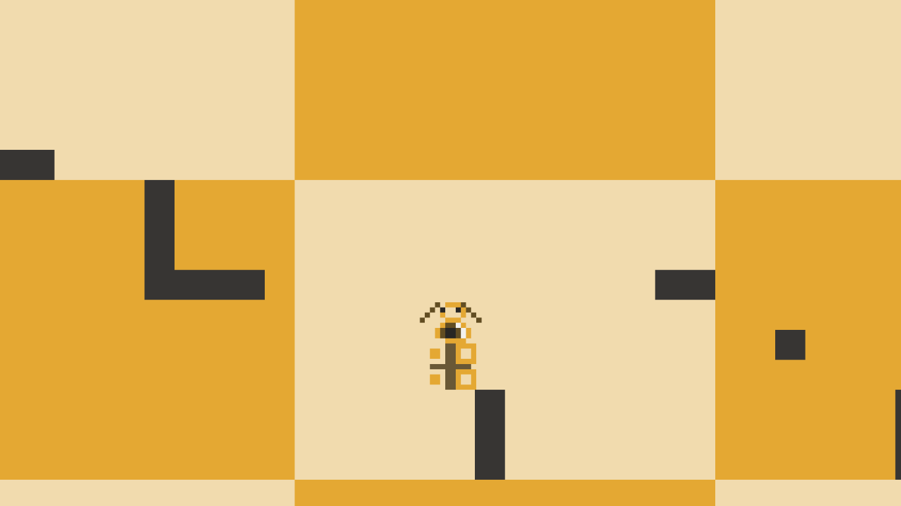

<h2>Table of Contents</h2>

<ul>
<li><a href="#sec-1">K9 Krew</a>
<ul>
<li><a href="#sec-1-1">Downloads</a></li>
<li><a href="#sec-1-2">Screenshots</a></li>
<li><a href="#sec-1-3">Acknowledgments</a></li>
<li><a href="#sec-1-4">Other Projects</a></li>
</ul>
</li>
</ul>

# K9 Krew

**Control two dogs with distinct powers and abilities to conquer complex labyrinths**

*K9 Krew* is a 2D game built built in Javascript.  Game features two fully completed levels.  More levels can be easily added by using a Tile Map Editor.

## Downloads

Latest releases can be found [here](https://github.com/woofers/k9-krew/releases).

## Screenshots

## Acknowledgments

-   **Built using** [Phaser](https://phaser.io/)

-   **Designed and Programed by** *Jaxson Van Doorn*

-   **Copyright 2014**, *Jaxson Van Doorn*

## Other Projects

-   [Woofers3D](https://github.com/woofers/woofers3d)

-   [Whale](https://github.com/woofers/whale)

-   [K9Krew](https://github.com/woofers/k9-krew)

-   [Dotfiles](https://github.com/woofers/dotfiles)
